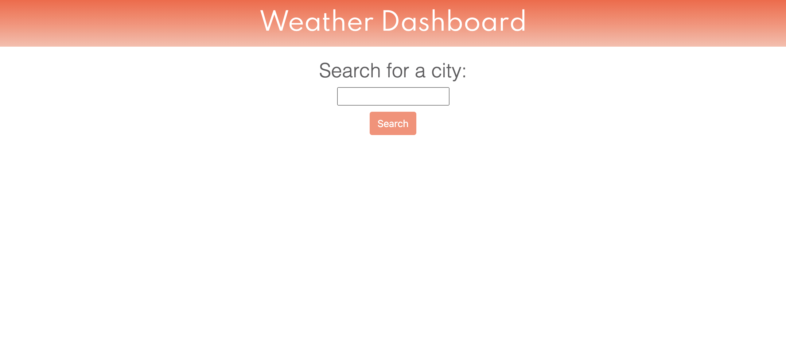
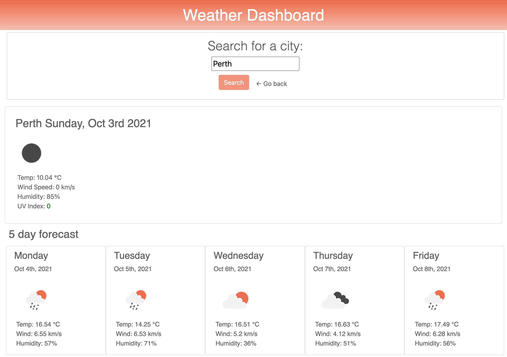
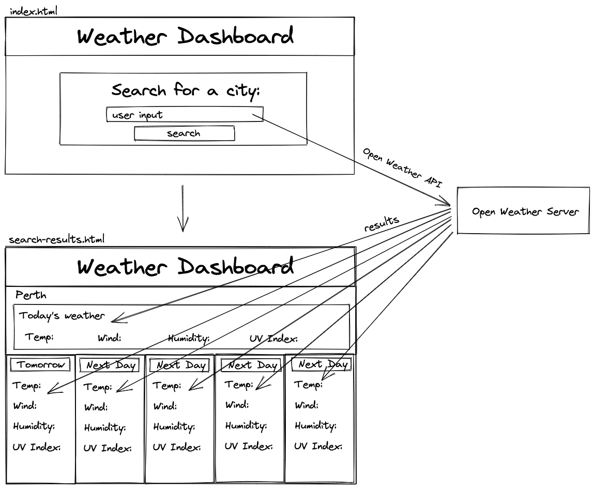

# weather-dashboard-HW-06
A search application which lets the user input a city name, and searches the current weather, and a 5 day forecast, using the Open Weather API.
 
- When a user searches a city, they are presented with the current weather and a 5 day forecast for that city.
- The current weather includes city name, the date, a weather icon, the temperature, the humidity, the wind speed, and the UV index.
- The UV index is colour coding to show severity of conditions
- The 5 day forecast cards include the date, a weather icon, the temperature, the wind speed, and the humidity.

I have used native JavaScript, because even though the code is longer, I find it much easier to follow.
 
I still need to fix the event listeners for the form on the search-page, and add in a function and event listeners for the search history. Once I get some time to finish these off, I will resubmit
 
 

# Screenshots
Search Page

Search Results Page

App Plan

# Links
Github: https://github.com/nicoletr/weather-dashboard-HW-06  
Deployed Application: https://nicoletr.github.io/weather-dashboard-HW-06/